# **IDS-Evasion**

## Index

- [Index](#index)

- [Attacks Snort could identify](#attacks-snort-could-identify)
  - [ElasticSearch Dynamic Script Arbitrary Java Execution (CVE-2014-3120)](#elasticsearch-dynamic-script-arbitrary-java-execution-cve-2014-3120)
  - [FTP Authentication Scanner (CVE-1999-0502)](#ftp-authentication-scanner-cve-1999-0502)
  - [OpenSSH MaxAuthTries Limit Bypass Vulnerability (CVE-2015-5600)](#openssh-maxauthtries-limit-bypass-vulnerability-cve-2015-5600)
  - [Jenkins-CI Script-Console Java Execution](#jenkins-ci-script-console-java-execution)
  - [Apache Struts REST Plugin With Dynamic Method Invocation Remote Code Execution (CVE-2016-3087)](#apache-struts-rest-plugin-with-dynamic-method-invocation-remote-code-execution-cve-2016-3087)
  - [ManageEngine Desktop Central 9 FileUploadServlet ConnectionId Vulnerability (CVE-2015-8249)](#manageengine-desktop-central-9-fileuploadservlet-connectionid-vulnerability-cve-2015-8249)

- [Attacks Snort could not identify](#attacks-snort-could-not-identify)
  - [Jenkins-CI Script-Console Java Execution](#jenkins-ci-script-console-java-execution-1)
  - [ElasticSearch Dynamic Script Arbitrary Java Execution (CVE-2014-3120)](#elasticsearch-dynamic-script-arbitrary-java-execution-cve-2014-3120-1)
  - [MS15-034 HTTP Protocol Stack Request Handling Denial-of-Service (CVE-2015-1635)](#ms15-034-http-protocol-stack-request-handling-denial-of-service-cve-2015-1635)

- [Drowning Snort by false positives](#)
  
- [Is it easier to fix the application than to detect attacks?](#so-is-it-easier-to-fix-the-application-than-to-detect-attacks)

- [References](#references)

---

## **Attacks Snort could identify**
### ElasticSearch Dynamic Script Arbitrary Java Execution ([CVE-2014-3120](https://www.cve.mitre.org/cgi-bin/cvename.cgi?name=2014-3120)):
Most of snort rules are *commented out* [by default](https://www.snort.org/faq/why-are-rules-commented-out-by-default). So we need to search for them either by product name (i.e. in our case "ElasticSearch") or even better by CVE (i.e. in our case "CVE-2014-3120") and *uncomment* them (i.e. remove the "#" character from the beginning of the line), in order to enable them. We can use the `Select-String` command (the "grep-like" command in PowerShell) for that purpose:


Running snort:


We'll use "exploit/multi/elasticsearch/script_mvel_rce" module to exploit this vulnerability (you can find this module using `search ElasticSearch` or `search CVE-2014-3120` inside Metasploit).

Setting module options, checking whether if the target is vulnerable or not and finally running the module:


Checking Snort:


As we see, snort identified the attack successfully.


### FTP Authentication Scanner ([CVE-1999-0502](https://cve.mitre.org/cgi-bin/cvename.cgi?name=CVE-1999-0502)):
We'll use "auxiliary/scanner/ftp/ftp_login" module to do a dictionary attack on the Target FTP service.
The search didn't show a result on "CVE-1999-0502" which is associated with the module (check the module info), so I couldn't find a rule to uncomment in those tons of rules (like trying to find a needle in a haystack!), so I'll write the rule myself.


First, we need to know what is the response of the target FTP service to unsuccessful logins in order to write a suitable PCRE (i.e. **P**erl **C**ompatible **R**egular **E**xpression) to match the unsuccessful logins:


I'll write two tailored rules, one for regular unsuccessful logins: 


.. & the other for detecting brute-forcing attempt:


We'll set our module options:


Note that "metasploitable3usernames.txt" contains the usernames I found from using "auxiliary/scanner/snmp/snmp_enumusers" module to enumerate the usernames:

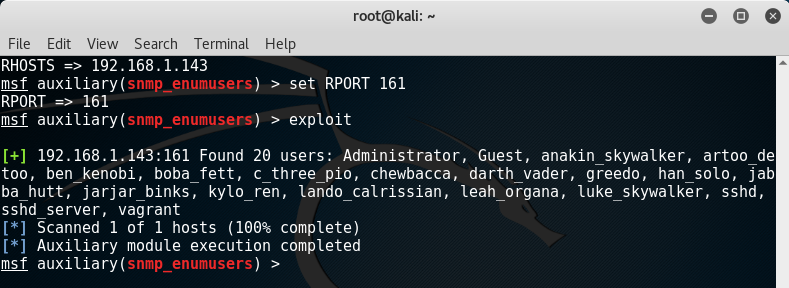

.. and after running the module we'll find only one successful trial:

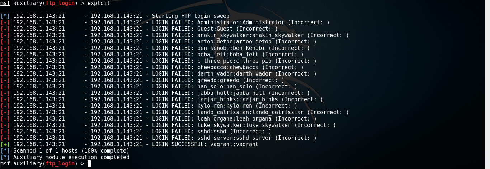

Given that we have 20 usernames in *PASS_FILE*:


.. Then we will expect an alert from *rule #1* for every unsuccessful login attempt (i.e.19 alerts) and an alert from *rule #2* for every 5 unsuccessful login attempts (i.e. 3 alerts because INTEGER_DIVISION(19/5)=3) occur within the determined threshold (i.e. 5 minutes):


Snort generates the same alerts if we used Hydra:


Notice that if we tried the same method with ssh_login module (i.e. write a rule to detect unsuccessful SSH login attempts), it will not work. The reason is that FTP sends the packets in *plain text* while the packets sent by SSH are *encrypted* (except for first few packets until the two parties agreed to the key as *Diffie–Hellman* key exchange algorithm).
Using Wireshark to examine packets sent from the target FTP service (using `ip.dst==192.168.1.14/32 and ip.src==192.168.1.143/32 and tcp.port eq 21` *filter* to narrow our search):


Note that all the packets are in *clear text*.

Using Wireshark to examine packets sent from The target SSH service (using `ip.dst==192.168.1.14/32 and ip.src==192.168.1.143/32 and tcp.port eq 22` *filter* to narrow our search):


So unlike FTP, we can't write a PCRE to match the packets sent from SSH in the same way we did before. But we'll see how to detect it in the next section.


### OpenSSH MaxAuthTries Limit Bypass Vulnerability ([CVE-2015-5600](https://cve.mitre.org/cgi-bin/cvename.cgi?name=CVE-2015-5600)):
We'll use "auxiliary/scanner/ssh/ssh_login" module to exploit this vulnerability. First we search for our rule:


Now the important piece in our rule is `content:"SSH-"; depth:4;`.. here "*content*" keyword makes snort look for "SSH-" string among the packets.. the "*depth*" keyword is a modifier to the "*content*".. simply, it tells snort how far into a packet it should search for the "SSH-" string.. in our case we are looking for "SSH-" within the first 4 bytes of the packet:


Setting module options & Run it.. it found one successful trial:


But when we check snort there is no alert. After examining the issue, I found that snort configuration file (i.e. snort.conf) didn’t include the file which contains our rule (i.e. indicator-scan.rules). So we've to include it by putting `include $RULE_PATH\indicator-scan.rules` in snort configuration file.

Now if we run the module again, Snort can detect the attack successfully:


### Jenkins-CI Script-Console Java Execution:
We'll use "exploit/multi/http/jenkins_script_console" module to exploit this vulnerability. This module uses the Jenkins-CI Groovy script console to execute OS commands using Java. 


Searching for the suitable rule among snort rules.. the vulnerability has no *CVE identifier* so we may search by product name (i.e. Jenkins) or we may try searching by module name (i.e. Jenkins_script_console):


.. and it looks like we found our desired rule.

After running the module we gained a meterpreter successfully:


Again when we check Snort there is no alert.. so first we'll go back and check our rule.. we'll change the content value to "POST /script" (in  [jenkins_script_console.rb](https://github.com/rapid7/metasploit-framework/blob/master/modules/exploits/multi/http/jenkins_script_console.rb) module there is `"#{@uri.path}script"` that concatenate the URI & "script".. the uri in the rule defined as "/jenkins" which is not right in our case).
Then we'll go to snort.conf file and add our port (i.e. 8484) to *HTTP_PORTS* variable.
Now if we run the module again, Snort generates the alerts successfully:


### Apache Struts REST Plugin With Dynamic Method Invocation Remote Code Execution ([CVE-2016-3087](https://cve.mitre.org/cgi-bin/cvename.cgi?name=CVE-2016-3087)):
First we search for our rule:

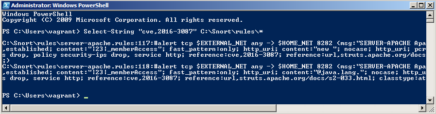

found two rules, we'll go and enable them (i.e. uncomment them).

To exploit this vulnerability, we'll use "exploit/multi/http/struts_dmi_rest_exec" module.
Setting module options & checking if our target is vulnerable:

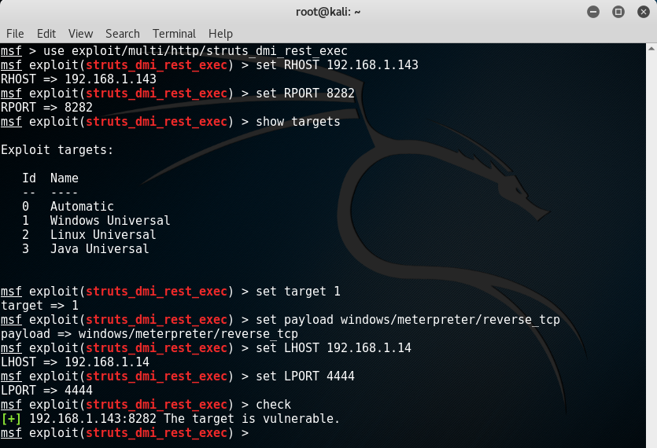

Run the module:

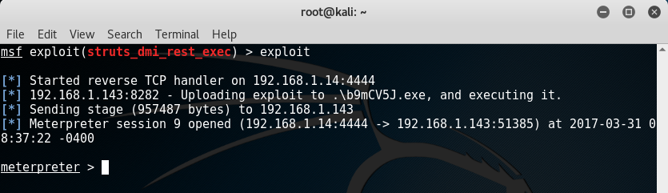

Unfortunately, when we check Snort, there is no alert generated. Before trying to solve this issue, let's inspect the sent packets with Wireshark (using `ip.src==192.168.1.14/32 and ip.dst==192.168.1.143/32 and tcp.port eq 8282` filter to narrow our search):

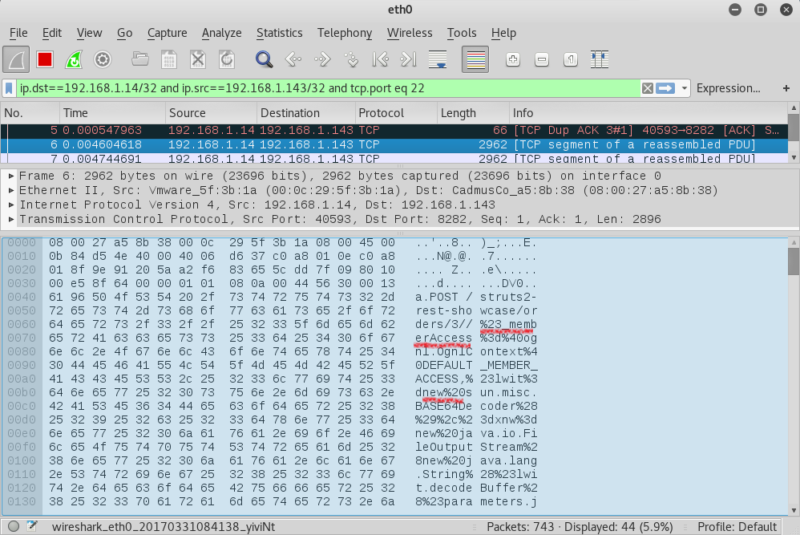

I managed to solve the issue in two different methods:

First method, I wrote a new rule to match the vulnerability based on the packet inspection I did in the previous step:

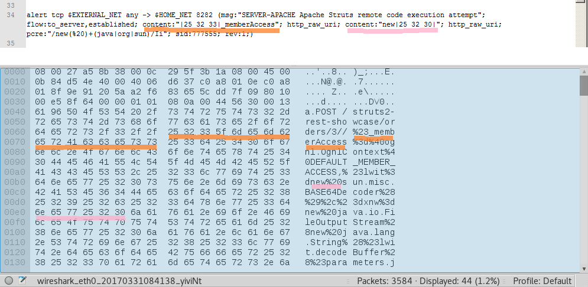

Note that we are matching the raw (i.e. unnormalized) URI:

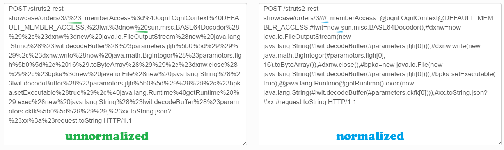

.. so we are trying to match "%23" and "%20". For that we have "http_raw_uri" and "I" modifiers to restrict the search to the unnormalized URI.

Now if we tried to run the exploit again, snort will detect it successfully:

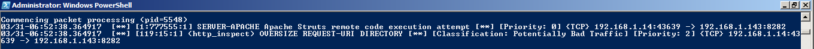

Second method, I made the two default rule works.. I found that if a rule is dealing with HTTP normalization, then I have to put its port (i.e. 8282) in http_inspect_server preprocessor that resides in Snort configuration file (i.e. snort.conf).

(The "http_inspect" preprocesor operates on "http_inspect_server" port list. The "http_inspect" preprocessor only inspects traffic on the ports within the http_inspect_server port list. So if a rule has "http_*" keyword(s) (e.g. http_uri), then its port has to be in the http_inspect_server port list.)

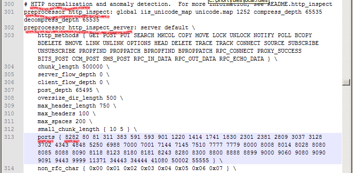

let's take a look on the two default rules:

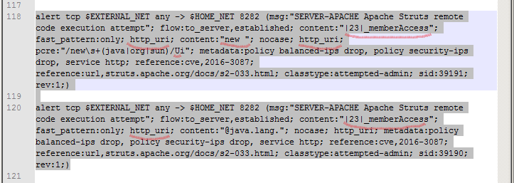

Unlike the previous custom rule, here we are trying to match the normalized URI (e.g. |23| is the Hexadecimal  for "#" ASCII character).. So here we have "http_uri" and "U" modifiers to restrict the search to the normalized URI.

And If we tried to run the exploit again, Snort will detect it successfully:

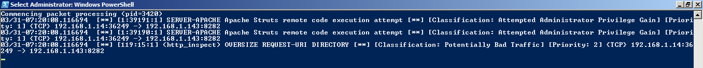


### ManageEngine Desktop Central 9 FileUploadServlet ConnectionId Vulnerability ([CVE-2015-8249](http://cve.mitre.org/cgi-bin/cvename.cgi?name=CVE-2015-8249)):
We'll start with searching for the rules:

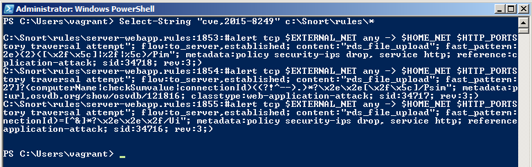

.. uncomment these three rules and add 8020 to http_inspect_server port list in snort.conf file.

Then, we'll use "exploit/windows/http/manageengine_connectionid_write" metasploit module to exploit this vulnerability:

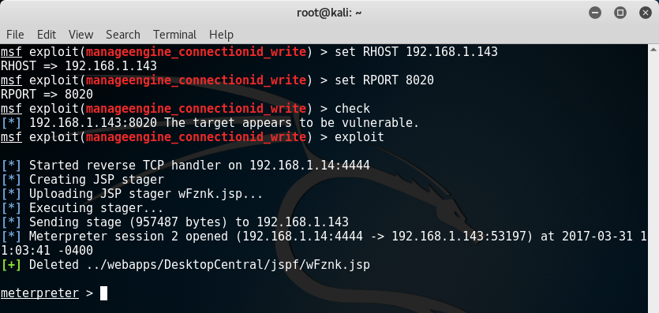

.. and Snort detect the attack:

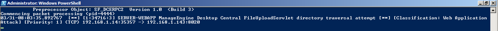

---

## **Attacks Snort could not identify**
### Jenkins-CI Script-Console Java Execution:
Yes, the same vulnerability again!.. but this time we won't get caught by snort. We'll use *Obfuscation* (i.e. manipulating data so that the IDS signature will not match the packet that is passed but the receiving device with still interpret it properly).

We know that these two commands are identical:


As we see, we move down into the directory tree and then uses the `../` to get back to the original location.
If the command is long enough, the IDS may, in the interest of saving CPU cycles, not process the entire string and miss the exploit code at the end. We'll take advantage of this concept of "*relative directories*" to evade Snort.  

What is snort looking for?  Let's take a look at our rule: 


We could manipulate `"POST /script"` to something like `"POST /down/downAgain/../../script"`.


We'll use the same settings as we did before except for one thing:


This option will insert fake relative directories into the URI.. let's run the module and do *packet inspection*:


As we see, the number of the move ups (i.e. `../`) have to be *equal* to the move downs (e.g. `/Directory`).. the final expression will evaluate to the same URI as before (i.e. `/script`) but the IDS will not notice the attack at all:


### ElasticSearch Dynamic Script Arbitrary Java Execution ([CVE-2014-3120](https://www.cve.mitre.org/cgi-bin/cvename.cgi?name=2014-3120)):
The same vulnerability identified by snort before, but we'll execute the attack in a bit different way to evade snort. 

As usual, Let's take a look at our rule:

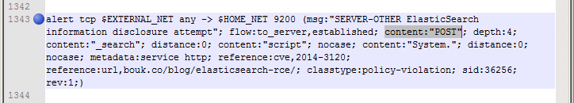

what the default rule misses here is the "nocase" modifier to `content:"POST"`. you might argue that there is two "nocase" modifiers.. but those belongs to `content:"script"` & `content:"System."`. Here I'll quote from Snort documentation:

> The nocase keyword allows the rule writer to specify that the Snort should look for the specific pattern, ignoring case. nocase modifies the previous content keyword in the rule.

So the "nocase" modifier affect the previous content keyword only. We'll take advantage of this mistake.. 
use "exploit/multi/elasticsearch/script_mvel_rce" metasploit module with the same settings -as we did before- execpt for this option:

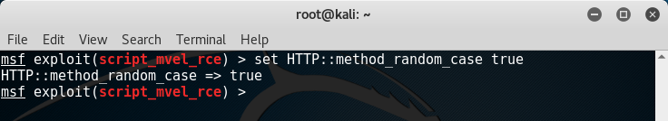

.. this option will use random casing for the HTTP method (i.e. gEt, GEt, GET, geT, ..etc).

without this option our packet normally looks like this:

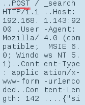

with this option being set, our packet may looks like these three random permutations:

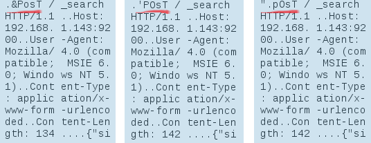

Now if we run the module, Snort has a probability of 0.0625 to caught us (i.e. 1/16, as our method is the four-charachters method POST so the available permutaions is 2^4).

I tried to execute the module and luckily snort didn't complain about it:


### MS15-034 HTTP Protocol Stack Request Handling Denial-of-Service ([CVE-2015-1635](http://www.cve.mitre.org/cgi-bin/cvename.cgi?name=cve-2015-1635)):
We'll use "auxiliary/dos/http/ms15_034_ulonglongadd" module to cause a *denial-of-service* to our target.

First, search for the rule and go enable it:


We will run Snort a bit differently this time.. using *fast* alert mode instead of *console* alert mode.. so that in case of the target machine became down won't miss the generated alerts (if there are such alerts):


Back to metasploit, set the *RHOST*.. we can check if the target is vulnerable in two ways.. first using the `check` command inside the module:


.. second way usning *telnet*, and wait to see if the server responds with "Requested Header Range Not Satisfiable", then the target may be vulnerable:


Run the module:


.. well, metsploit says us that execution completed. Now let's go see what happens to our target machine from these five consecutive screenshots:


After the target machine is up again after reboot, we'll go to "*\Snort\log*" directory and check the "*alert.ids*" file. I found nothing so we could guess that Snort didn't caught the attack.

I tried to add new rules: 


.. but Snort still didn't detect the attack.
Although I managed to trigger the rules with *wget*(i.e. `wget --header "Range: bytes=1-18446744073709551615" http://192.168.1.143`) , *curl*(i.e. `curl -v 192.168.1.143/ -H "Host: test" -H "Range: bytes=0-18446744073709551615"`) and *telnet*(like how we check if the target is vulnerable before), Snort didn't identify the metasploit attack.

---

## **So is it easier to fix the application than to detect attacks?**

Fixing is better because "pattern matching" is awful, you've to be precise to avoid false positives and sometimes being precise means that the attackers can evade your rules. 
Also you can't be sure that IDS will detect all the novel attacks as the attackers may execute their attacks in a devious ways.. including, but not limited to obfuscation, flooding, encryption and fragmentation.

There are other cases when you deploy a product that doesn't belong to you. So if a vulnerability announced, sometimes product provider can't instantly create a patch for this vulnerability or guide you with workarounds to mitigate its consequences. In that case, Incident Response Engineer has to write an attack signature for this attack. 

Another issue to consider is Zero-Day exploits -as almost every organization is at risk for zero-day exploits-, here the vulnerability is undisclosed -you don't know what you don't know!- so we are somehow compelled to use IDSs. Protecting against these kind of exploits may require mixing signature-based technique with statistical-based and behavior-based techniques.

Not properly configured IDS leads to a lot of false-positives which make security team not taking the alerts seriously. Also even if IDS detects an attack, the odds are that these (i.e. packets) contain spoofed IP addresses and somehow reduce the possibility of finding the actual attackers.

So I think that Fixing for sure is better when possible.. it prevents you from the burdens of IDSs.

---

## **Drowning Snort by false positives**:

In this section, our main goal is to make Snort generate a lot of false positive alarms in order to drown out legitimate alerts (i.e. true positives). Beides overwhelming security team members, you may sneak your actual attack amongst these tons of false positive alerts. Also generating such tremendous traffic may force Snort to drop some packets, so it might not see the attacks. 

Let's get started.. we'll trigger a rule to make Snort generate a false positive alarm without an actual attack going on. First, let's take a look on our rule:

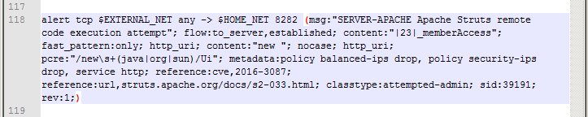

Using curl to trigger the rule:

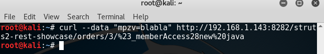

Snort result show that our rule (i.e. sid:39191) triggered successfully and thankfully the custom rule we wrote before(i.e. sid:777555):

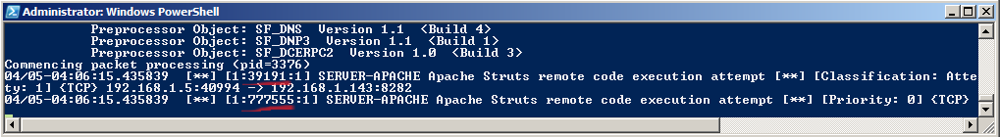

We can embed this command inside a script to generate a huge load of false positive alerts.. but there is a problem:

our real IP is logged.. so that is not a good thing. Well, you can use curl through a VPN (here we've a VPN at port 9666 on localhost):

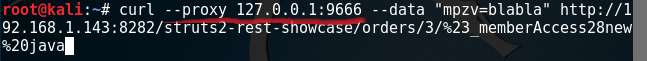

But how about spoofing an IP address? before answering lets briefly discuss what is the difference between TCP & UDP protocols.. among all the differences, what matters is TCP establishes a connection through 3-way handshake(i.e. [->>SYN->>] [<<-SYN/ACK<<-] [->>ACK->>]) before transmitting the actual data whereas UDP doesn't because it is a connectionless protocol. So -normally- "spoofing an IP address" in TCP context is a crazy idea.. imagine sending an envelope to person **A** after changing the sender address, how could you expect **A**'s response to get back to you?.. a basic fact that a machine that recieves an unsolicited (i.e. unexpected) SYN/ACK packet will respond with a RST packet. Let's see an example of this behavior..

In order to spoof an IP address, I scanned my local network passively to find candidates using `netdiscover -p -r 192.168.1.0/24`:

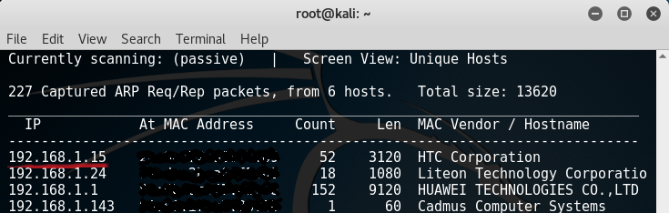

.. then I sent a SYN packet with a spoofed IP (i.e. 192.168.1.15) using scapy:

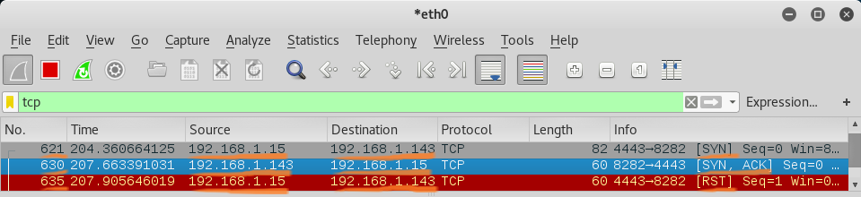

what happened here is:
  1. We send packet #621 (SYN) to our target (i.e. 192.168.1.143) from our kali machine (i.e. 192.168.1.*5*) but we changed the source address to another machine (i.e. 192.168.1.*15*) before sending the packet.
  2. The target machine recieved the SYN packet, so it replied with packet #630 (SYN/ACK) to 192.168.1.*15*.
  3. The real 192.168.1.*15* recieves the SYN/ACK packet.. and because it didn't actually send packet #621 in the first place(i.e. unsolicited SYN/ACK), so it respond with packet #635 (RST) to our target.
 
that is why we can't achieve a TCP connection with a spoofed IP. Also you may wonder why I scanned for candidate host first to be spoofed instead of using an arbitrary IP (e.g. 192.168.222).. to explain why this is not possible if this IP is not reachable in our network.. let's examine the ARP packets that sent between #621, #630 and #635 packets:

  1. Our target host recieve SYN packet with 192.168.1.15 as source address.. so the target (i.e. 192.168.1.143) sends a broadcast packet #622 to the network using ARP protocol to ask "who has 192.168.1.15?":
  
  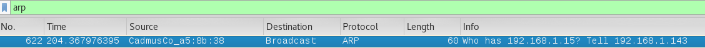

  Note: 
      - The "*broadcast packet*" is sent to a special MAC address that causes all machines on the network to receive it.
	  - The machine with the requested IP address will reply with an ARP packet that contains it's MAC address.
  
  2. Then 192.168.1.15 replies with an ARP packet #631 with its MAC address (i.e. "192.168.1.15 is at [it's MAC address]"):
  
  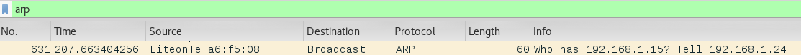

  3. After the target host recieves the MAC address of 192.168.1.15, it sends the SYN-ACK packet #630.
  4. Then 192.168.1.*15* sends a broadcast packet #632 to the network using ARP protocol to ask "who has 192.168.1.143":
  
  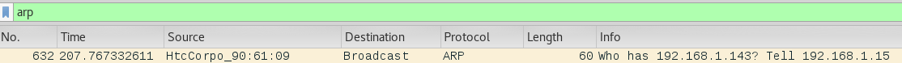
  
  5. Then our target host replies with an ARP packet #633 with its MAC address (i.e. "192.168.1.143 is at [it's MAC address]"):
  
  

Now what if we used unreachable IP as our source address (e.g. 192.168.1.222).. let's see:

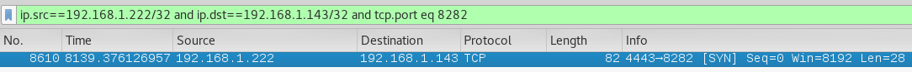

what happened is that we sent packet #8610 (SYN) to our target (i.e. 192.168.1.143) from our kali machine (i.e. 192.168.1.*5*) but we changed the source address to another unreachable machine (i.e. 192.168.1.*222*) before sending the packet. If we examined the ARP packets:


.. we'll find that after the target (i.e. 192.168.1.143) recieved the SYN packet, it'll send a broadcast packet #8611 to the network using ARP protocol.. then nothing happened as the requested IP address (i.e. 192.168.1.*222*) is not directly reachable IP address.. so the data delivery is not possible.


### Snort rule (sid:*37526*):

  `alert udp $EXTERNAL_NET any -> $HOME_NET 123 (msg:"SERVER-OTHER NTP arbitrary pidfile and driftfile overwrite attempt"; flow:to_server; content:"pidfile"; fast_pattern:only; metadata:policy balanced-ips drop, policy max-detect-ips drop, policy security-ips drop, service ntp; reference:bugtraq,77278; reference:cve,2015-7703; reference:url,support.ntp.org/bin/view/Main/NtpBug2902; classtype:policy-violation; sid:37526; rev:2;)`

Triggering the rule with a crafted packet using Scapy:


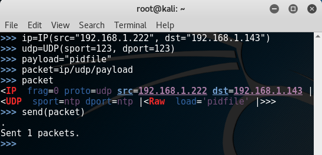

Note that we are using UDP.. so it doesn't matter if the spoofed IP is up (i.e. reachable through our network) or not.

Snort result:

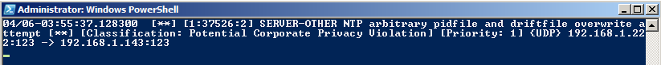


### Snort rule (sid:*30882*):

  `alert udp $EXTERNAL_NET any -> $HOME_NET 53 (msg:"MALWARE-CNC Win.Trojan.Rbrute inbound connection"; flow:to_server; dsize:4; content:"|BE BA FE CA|"; fast_pattern:only; metadata:impact_flag red, policy balanced-ips drop, policy security-ips drop; reference:url,www.virustotal.com/en/file/eec964dd018ad0c40ff3d7f3a3938350522119122a0cc9711212950fc06b14a0/analysis/; classtype:trojan-activity; sid:30882; rev:2;)`

Triggering the rule with a crafted packet using Scapy:

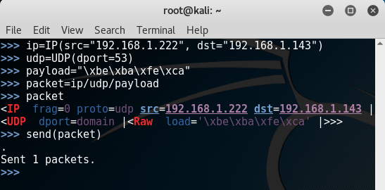

Snort result:

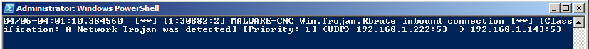


### Snort rule (sid:*31136*):

  `alert udp $EXTERNAL_NET any -> $HOME_NET [16464,16465,16470,16471] (msg:"MALWARE-CNC Win.Trojan.ZeroAccess inbound connection"; flow:to_server; dsize:16; content:"|28 94 8D AB|"; depth:4; offset:4; metadata:impact_flag red, policy balanced-ips drop, policy connectivity-ips drop, policy security-ips drop, ruleset community; reference:url,www.virustotal.com/file/50cdd9f6c5629630c8d8a3a4fe7d929d3c6463b2f9407d9a90703047e7db7ff9/analysis/; classtype:trojan-activity; sid:31136; rev:2;)`

Triggering the rule with a crafted packet using Scapy:

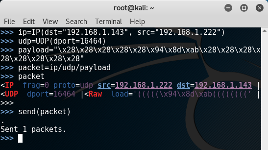

Snort result:

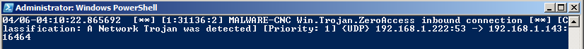

### Mixing these three rules together:

our script:

	```python
	#!/usr/bin/env python

	from scapy.all import *

	packet_ip = IP(dst="192.168.1.143" , src="192.168.1.222")

	udp_1 = UDP(dport=123, sport=123)
	payload_1 = "pidfile"

	udp_2 = UDP(dport=53, sport=4443)
	payload_2 = "\xbe\xba\xfe\xca"

	udp_3 = UDP(dport=16464, sport=4444)
	payload_3 = "\x28\x28\x28\x28\x28\x94\x8d\xab\x28\x28\x28\x28\x28\x28\x28\x28"

	packet_1 = packet_ip/udp_1/payload_1
	packet_2 = packet_ip/udp_2/payload_2
	packet_3 = packet_ip/udp_3/payload_3

	packets= [packet_1, packet_2, packet_3]

	send(packets, loop=1)
	```

.. this script sent 4565 packets in 10 seconds only.. in other words, Snort generated 4565 false positive alerts in this very short period.. also keep in mind that we used 3 rules only.. imagine what will happen if we used a lot of rules!.. you may sneak your actual attack while running this kind of scripts. This explains why the notion of *False Positives* is one of the biggest headaches in *Cybersecurity*.


---

## *References*:

###### [C. Del Carlo, "Intrusion Detection Evasion: How an attacker get past the burglar alarm", SANS Institute InfoSec Reading Room, 2003](https://www.sans.org/reading-room/whitepapers/detection/intrusion-detection-evasion-attackers-burglar-alarm-1284).

###### [D. Hammarberg, “The Best Defenses against Zero-day Exploits for Various-sized Organizations”, SANS Institute InfoSec Reading Room, 2014](https://www.sans.org/reading-room/whitepapers/bestprac/defenses-zero-day-exploits-various-sized-organizations-35562).