# **IDS-Evasion**
## **Attacks Snort could identify**
### ElasticSearch Dynamic Script Arbitrary Java Execution ([CVE-2014-3120](https://www.cve.mitre.org/cgi-bin/cvename.cgi?name=2014-3120)):
Most of snort rules are *commented out* [by default](https://www.snort.org/faq/why-are-rules-commented-out-by-default). So we need to search for them either by product name (i.e. in our case "ElasticSearch") or even better by CVE (i.e. in our case "CVE-2014-3120") and *uncomment* them (i.e. remove the "#" character from the beginning of the line), in order to enable them. We can use the `Select-String` command (the "grep-like" command in powershell) for that purpose:
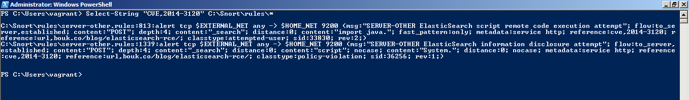
Running snort:
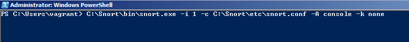
We'll use "exploit/multi/elasticsearch/script_mvel_rce" module to exploit this vulnerability (you can find this module using "search ElasticSearch" or "search CVE-2014-3120").
Setting module options, checking if the target is vulnerable and finally running the module:
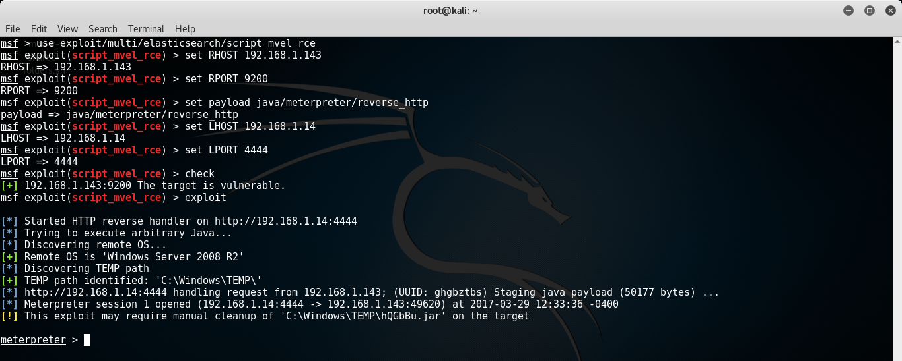
Checking Snort:
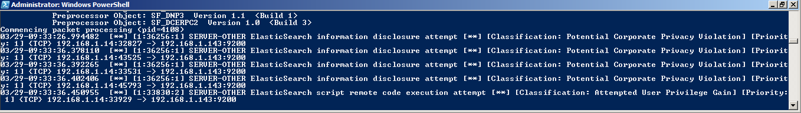
As we see, snort identified the attack successfully.

### FTP Authentication Scanner ([CVE-1999-0502](https://cve.mitre.org/cgi-bin/cvename.cgi?name=CVE-1999-0502)):
The search didn't show a result on "CVE-1999-0502" which is associated with the module (check the module info), so I couldn't find a rule to uncomment in those tons of rules (like trying to find a needle in a haystack!), so I'll write the rule myself.
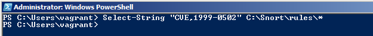
First, we need to know what is the response of the target ftp service to unsuccessful logins in order to write a suitable PCRE (i.e. **P**erl **C**ompatible **R**egular **E**xpression) to match the unsuccessful logins:
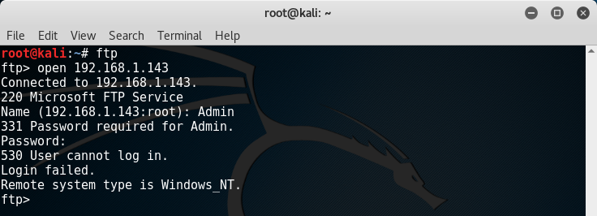
I'll write two tailored rules, one for regular unsuccessful logins: 
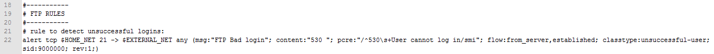
.. & another for detecting brute-forcing attempt:
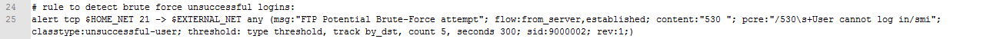
After running the module we'll find only one successful trial:
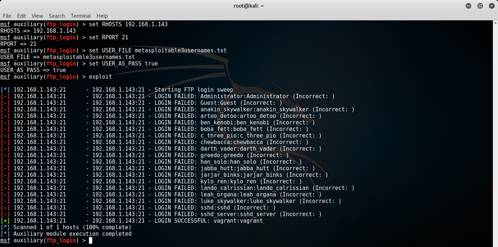
Given that we have 20 usernames in PASS_FILE:
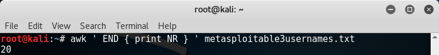
.. Then we will expect an alert from rule #1 for every unsuccessful login attempt (i.e.19 alerts) and an alert from rule #2 for every 5 unsuccessful login attempts (i.e. 3 alerts because INTEGER_DIVISION(19/5)=3) occur within the determined threshold (i.e. 5 minutes):
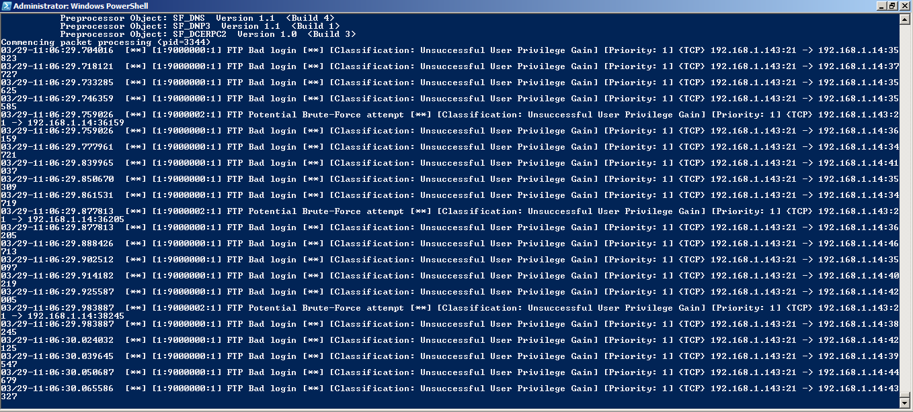
Snort generates the same alerts if we used hydra:
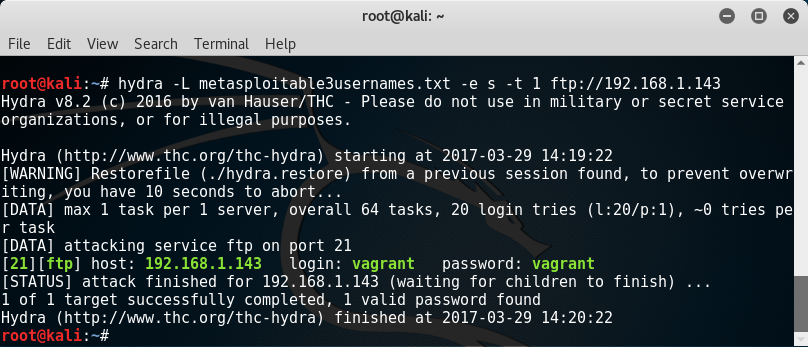
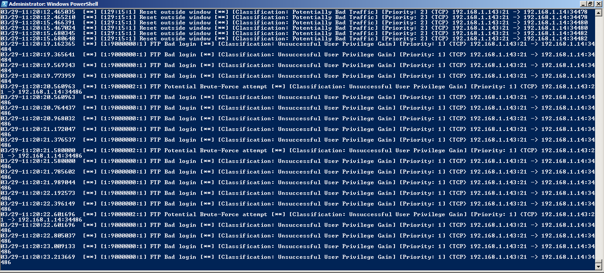
Notice that if we tried the same method with ssh_login module (i.e. write a rule to detect unsuccessful SSH login attempts), it will not work. The reason is that FTP sends the packets in plain text while the packets sent by SSH are encrypted (except for first few packets until the two parties agreed to the key as Diffie–Hellman key exchange algorithm) .
Using Wireshark to examine packets sent from the target FTP service (using "ip.dst==192.168.1.14/32 and ip.src==192.168.1.143/32 and tcp.port eq 21" filter to narrow our search):
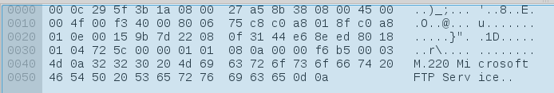
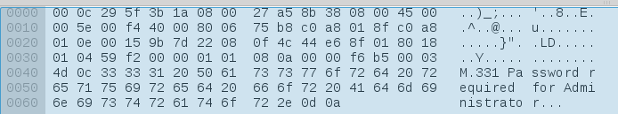
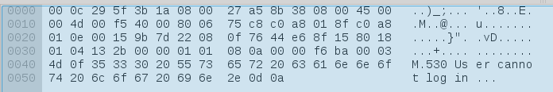
Note that all the packets are in clear text.
Using Wireshark to examine packets sent from The target SSH service (using "ip.dst==192.168.1.14/32 and ip.src==192.168.1.143/32 and tcp.port eq 22" filter to narrow our search):
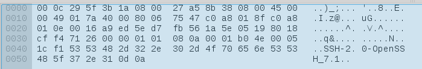
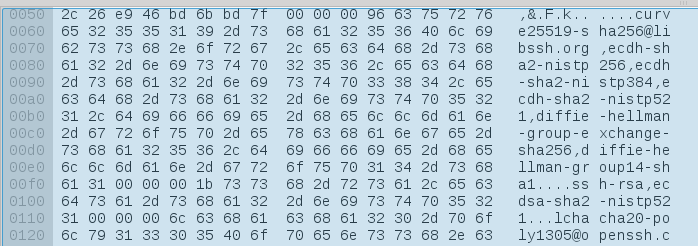
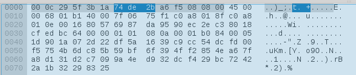
So unlike FTP, we can't write a PCRE to match the packets sent from SSH in the same way we did before. But we'll see how to detect it in the next section.

### OpenSSH MaxAuthTries Limit Bypass Vulnerability ([CVE-2015-5600](https://cve.mitre.org/cgi-bin/cvename.cgi?name=CVE-2015-5600)):
We'll use "auxiliary/scanner/ssh/ssh_login" module to exploit this vulnerability. First we search for our rule:
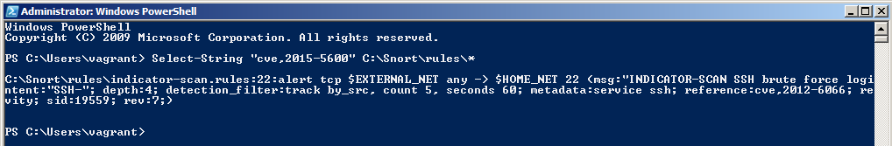
Now the important piece in our rule is (content:"SSH-"; depth:4;).. here "content" keyword makes snort look for "SSH-" string among the packets.. the "depth" keyword is a modifier to the "content".. simply, it tells snort how far into a packet it should search for the "SSH-" string.. in our case we are looking for "SSH-" within the first 4 bytes of the packet:
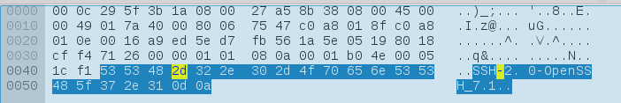
Setting module options & Run it.. it found one successful trial:
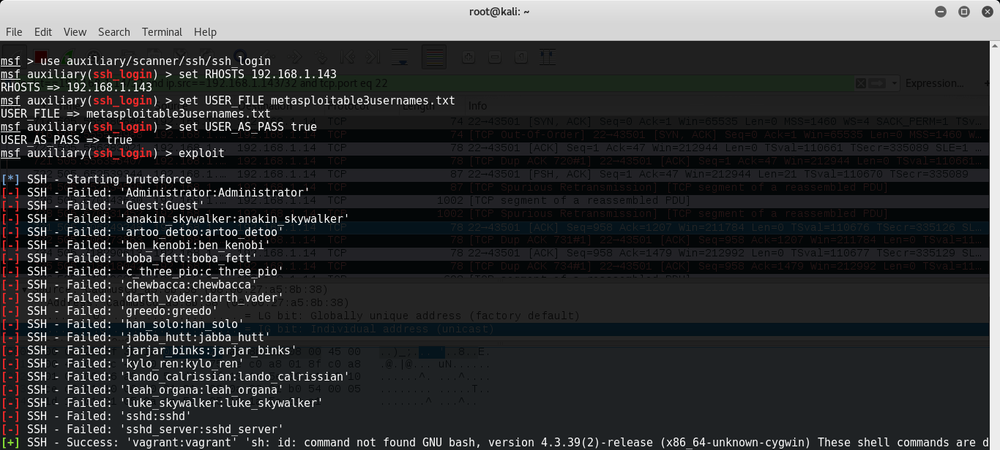
But when we check snort there is no alert. After examining the issue, I found that snort configuration file (i.e. snort.conf) didn’t include the file which contains our rule (i.e. indicator-scan.rules). So we've to include it by putting "include $RULE_PATH\indicator-scan.rules" in snort configuration file.
Now if we run the module again, snort can detect the attack successfully:
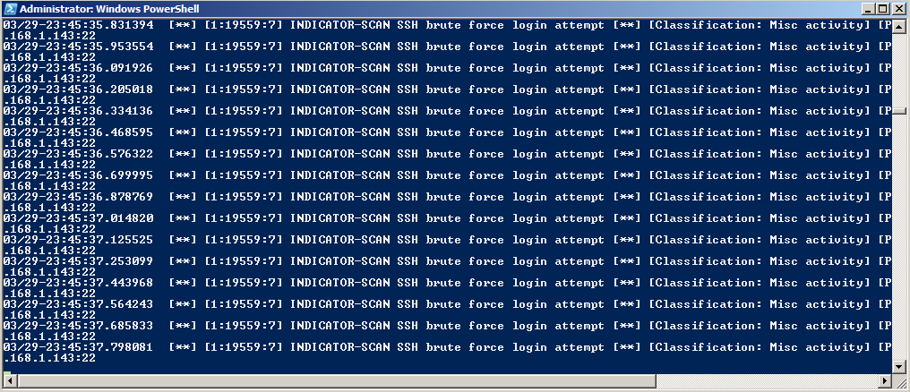
